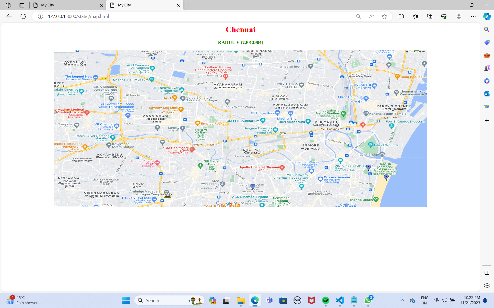
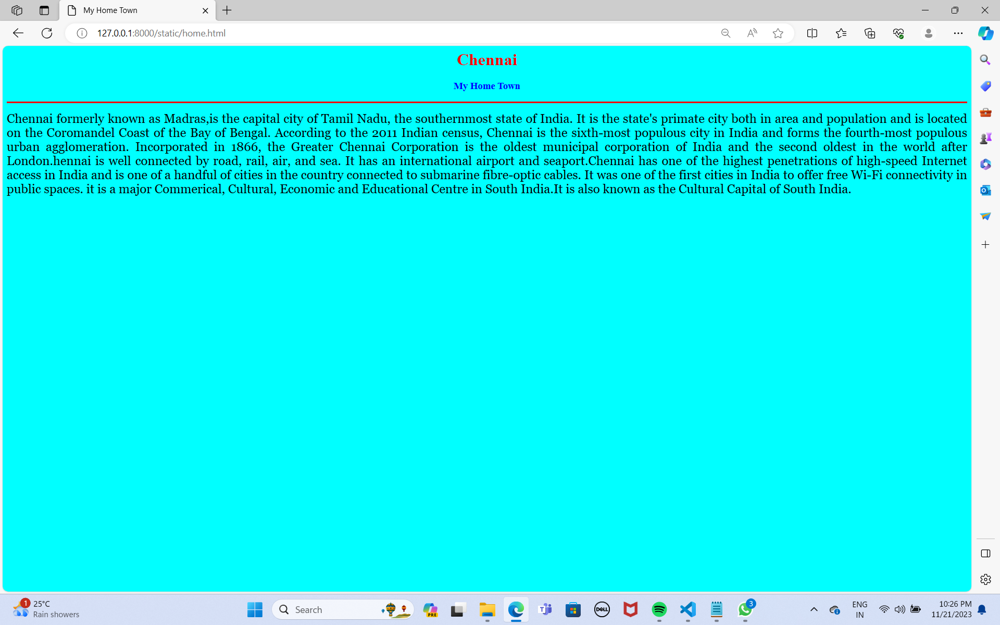
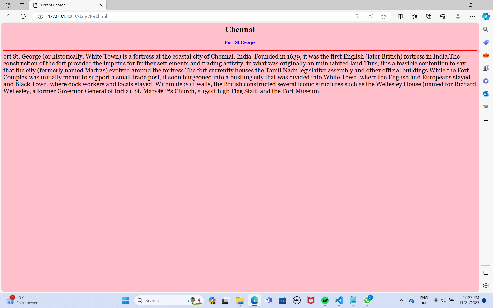
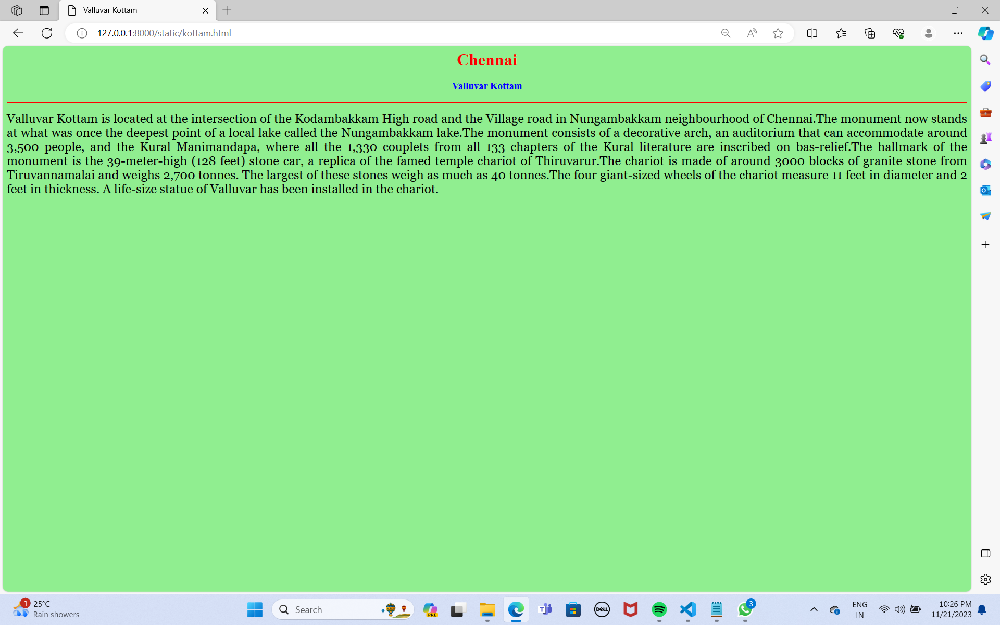

# Ex04 Places Around Me
## Date: 22.11.2023

## AIM
To develop a website to display details about the places around my house.

## DESIGN STEPS

### STEP 1
Create a Django admin interface.

### STEP 2
Download your city map from Google.

### STEP 3
Using ```<map>``` tag name the map.

### STEP 4
Create clickable regions in the image using ```<area>``` tag.

### STEP 5
Write HTML programs for all the regions identified.

### STEP 6
Execute the programs and publish them.

## CODE
```
map.html

<html>
<head>
<title>My City</title>
</head>
<body>
<h1 align="center">
<font color="red"><b>Chennai</b></font>
</h1>
<h3 align="center">
<font color="green"><b>RAHUL V (23012304)</b></font>
</h3>
<hr size="3" color="red">
<center>

<map name="MyCity">
<area shape="rect" coords="600,120,730,150" href="home.html" title="My Home Town">
<area shape="rect" coords="400,550,460,570" href="temple.html" title="Arulmigu Murugan Temple ">
<area shape="rect" coords="1250,440,1300,660" href="beach.html" title="Marina Beach ">
<area shape="rect" coords="750,520,800,550" href="kottam.html" title="Valluvar Kottam">
<area shape="rect" coords="1290,280,1330,320" href="fort.html" title="Fort St.George">
</map>
</center>
</body>
</html>

home.html

<html>
<head>
<title>My Home Town</title>
</head>
<body bgcolor="cyan">
<h1 align="center">
<font color="red"><b>Chennai</b></font>
</h1>
<h3 align="center">
    <font color="blue"><b>My Home Town</b></font>
 </h3>
<hr size="3" color="red">
<p align="justify">
<font face="Georgia" size="5">
Chennai formerly known as Madras,is the capital city of Tamil Nadu, the southernmost state of India. It is the state's primate city both in area and population and is located on the Coromandel Coast of the Bay of Bengal. According to the 2011 Indian census, Chennai is the sixth-most populous city in India and forms the fourth-most populous urban agglomeration. Incorporated in 1866, the Greater Chennai Corporation is the oldest municipal corporation of India and the second oldest in the world after London.hennai is well connected by road, rail, air, and sea. It has an international airport and seaport.Chennai has one of the highest penetrations of high-speed Internet access in India and is one of a handful of cities in the country connected to submarine fibre-optic cables. It was one of the first cities in India to offer free Wi-Fi connectivity in public spaces. it is a  major Commerical, Cultural, Economic and Educational Centre in South India.It is also known as the Cultural Capital of South India.

</font>
</p>
</body>
</html>

beach.html

<html>
<head>
<title>Fort St.George</title>
</head>
<body bgcolor="pink">
<h1 align="center">
<font color="black"><b>Chennai</b></font>
</h1>
<h3 align="center">
    <font color="blue"><b>Fort St.George
    </b></font>
</h3>
<hr size="3" color="red">
<font face="Georgia" size="5">
ort St. George (or historically, White Town) is a fortress at the coastal city of Chennai, India. Founded in 1639, it was the first English (later British) fortress in India.The construction of the fort provided the impetus for further settlements and trading activity, in what was originally an uninhabited land.Thus, it is a feasible contention to say that the city (formerly named Madras) evolved around the fortress.The fort currently houses the Tamil Nadu legislative assembly and other official buildings.While the Fort Complex was initially meant to support a small trade post, it soon burgeoned into a bustling city that was divided into White Town, where the English and Europeans stayed and Black Town, where dock workers and locals stayed. Within its 20ft walls, the British constructed several iconic structures such as the Wellesley House (named for Richard Wellesley, a former Governor General of India), St. Mary’s Church, a 150ft high Flag Staff, and the Fort Museum.

</font>
</p>
</body>
</html>

temple.html

<html>
<head>
<title>Vadapalani Murugan Temple</title>
</head>
<body bgcolor="lightblue">
<h1 align="center">
<font color="red"><b>Chennai</b></font>
</h1>
<h3 align="center">
    <font color="blue"><b>Vadapalani Murugan Temple
    </b></font>
</h3>
<hr size="3" color="red">
<p align="justify">
<font face="Georgia" size="5">
Vadapalani Andavar Temple is a Hindu temple dedicated to Lord Muruga. It is located in Vadapalani, Chennai, Tamil Nadu, India.It was renovated in the 1920s and a Rajagopuram was built during that time. The temple has grown in popularity, which is believed to be in part due to the patronage of cinema stars.The temple is built on the traditional lines of south Indian temples. The Rajagopuram at the entrance has several stuccos with the legends of the Skanda Purana depicted on them. The Moolavar (main deity) resembles the Palani temple idol and is in standing position.ts Palani Murugan temple in chennai i.e in north of Palani. Hence its called as VADAPALANI(Vada is referred to vadakku i.e. north) Its one of biggest murugan temple in chennai. Its must visit in chennai.
</font>
</p>
</body>
</html>

fort.html

<html>
<head>
<title>Fort St.George</title>
</head>
<body bgcolor="pink">
<h1 align="center">
<font color="black"><b>Chennai</b></font>
</h1>
<h3 align="center">
    <font color="blue"><b>Fort St.George
    </b></font>
</h3>
<hr size="3" color="red">
<font face="Georgia" size="5">
ort St. George (or historically, White Town) is a fortress at the coastal city of Chennai, India. Founded in 1639, it was the first English (later British) fortress in India.The construction of the fort provided the impetus for further settlements and trading activity, in what was originally an uninhabited land.Thus, it is a feasible contention to say that the city (formerly named Madras) evolved around the fortress.The fort currently houses the Tamil Nadu legislative assembly and other official buildings.While the Fort Complex was initially meant to support a small trade post, it soon burgeoned into a bustling city that was divided into White Town, where the English and Europeans stayed and Black Town, where dock workers and locals stayed. Within its 20ft walls, the British constructed several iconic structures such as the Wellesley House (named for Richard Wellesley, a former Governor General of India), St. Mary’s Church, a 150ft high Flag Staff, and the Fort Museum.

</font>
</p>
</body>
</html>

kottam.html

<html>
<head>
<title>Valluvar Kottam</title>
</head>
<body bgcolor="lightgreen">
<h1 align="center">
<font color="red"><b>Chennai</b></font>
</h1>
<h3 align="center">
    <font color="blue"><b>Valluvar Kottam
    </b></font>
</h3>
<hr size="3" color="red">
<p align="justify">
<font face="Georgia" size="5">
Valluvar Kottam is located at the intersection of the Kodambakkam High road and the Village road in Nungambakkam neighbourhood of Chennai.The monument now stands at what was once the deepest point of a local lake called the Nungambakkam lake.The monument consists of a decorative arch, an auditorium that can accommodate around 3,500 people, and the Kural Manimandapa, where all the 1,330 couplets from all 133 chapters of the Kural literature are inscribed on bas-relief.The hallmark of the monument is the 39-meter-high (128 feet) stone car, a replica of the famed temple chariot of Thiruvarur.The chariot is made of around 3000 blocks of granite stone from Tiruvannamalai and weighs 2,700 tonnes. The largest of these stones weigh as much as 40 tonnes.The four giant-sized wheels of the chariot measure 11 feet in diameter and 2 feet in thickness. A life-size statue of Valluvar has been installed in the chariot.
</font>
</p>
</body>
</html>
```

## OUTPUT








## RESULT
The program for implementing image maps using HTML is executed successfully.
